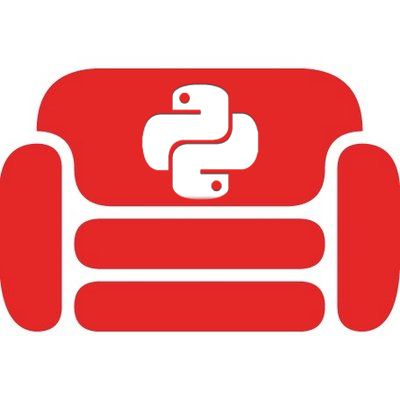

Async-Couch
=========================================

.. image:: https://readthedocs.org/projects/async-couch/badge/?version=latest
   :target: https://async-couch.readthedocs.io/en/latest/?badge=latest
   :alt: Documentation Status
   :align: center

Resources
#########
   * `Documentation <https://async-couch.readthedocs.io/en/stable/>`_

This is simple asynchronous python CouchDB client that works with
aiohttp, httpx and able to be adopted eassylly to any other http client.

Requirements:
#############
   * >= Python 3.6

Allowed http client:
####################
   * `aiohttp <https://docs.aiohttp.org/en/stable/>`_
   * `httpx <https://www.python-httpx.org/>`_

How to install
##############
.. code-block:: bash

   pip install async-couch

Get Started
############
.. code-block:: python
   :linenos:

   import asyncio

   from async_couch import get_couch_client
   from async_couch.http_clients import HttpxCouchClient

   async def example(client, doc_id: str):
      await client.db_create('test_index')
      await client.doc_create_or_update('test_index', 'test_doc', dict(val=1))

      response = await client.doc_get('my_index', response.model._id)
      assert response.model._id == 'test_doc'

      await client.attachment_upload(
         'my_index', response.model._id, 'attachment_name', 'text/plain', b'\0')

   if __name__ == '__main__':
      loop = asyncio.get_event_loop()
      client = get_couch_client(request_adapter=HttpxCouchClient)

      loop.run_until_complete(example(client, 'document_name'))

ToDo
#####
- Rest endpoints
- Aiohttp adapter
